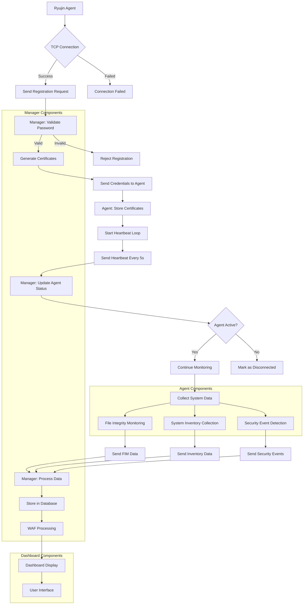

# Ryujin Security 🐉

Ryujin Security security monitoring and management.

## Our Projects

### [Ryujin Manager](https://github.com/ryujin-security/ryujin-manager)
Core management service that handles agent communication and certificate management.
- 🔐 Secure agent registration
- 📜 Certificate management
- 🔄 Real-time monitoring
- 🛡️ TLS-encrypted communication

### [Ryujin Agent](https://github.com/ryujin-security/ryujin-agent)
Endpoint security and monitoring agent.
- 🔍 File Integrity Monitoring (FIM)
- 📊 System Inventory Collection
- 🔒 Secure Authentication
- 🖥️ Real-time System Monitoring

### [Ryujin Dashboard](https://github.com/ryujin-security/ryujin-dashboard)
Web interface for security monitoring and management.
- 📈 Real-time Monitoring
- 🎯 Event Visualization
- ⚙️ Configuration Management
- 📱 Responsive Design
  

All projects are created by Ryan Rizky Pratama & Reja Revaldy F 
